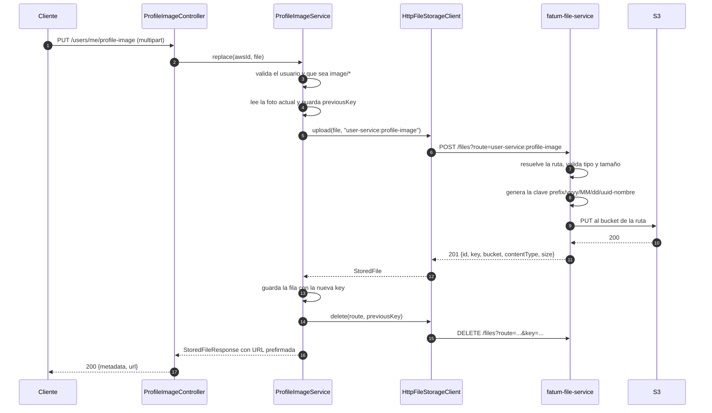

# El paquete `fatum.storage` y el flujo de archivos

## 1. Por qué existe el paquete

El servicio de usuarios necesita guardar archivos (foto de perfil, documentos de identidad, y más
adelante evidencias de prueba de vida) pero **no debe saber nada de buckets**. Ese conocimiento se
movió a un microservicio aparte, `fatum-file-service`, y `fatum.storage` es la frontera entre los dos.

La idea que sostiene todo el diseño es esta:

> El servicio de usuarios **nombra un propósito** (`user-service:document`), y el servicio de archivos
> decide **en qué bucket** cae ese propósito.

Por eso el paquete tiene seis clases y ninguna habla de S3, de regiones ni de credenciales. Todo eso
vive en el otro servicio.

## 2. El contrato: `FileStorageClient`

Es el puerto. Cuatro operaciones, y el nombre de la ruta **viaja en cada llamada** en lugar de estar
fijo en el cliente:

| Operación | Para qué |
| --- | --- |
| `upload(MultipartFile file, String route)` | Sube un archivo que llegó en un `multipart/form-data` |
| `upload(byte[] content, String filename, String contentType, String route)` | Sube contenido construido en memoria (el PDF que resulta de unir las dos caras del documento) |
| `delete(String route, String objectKey)` | Borra un objeto. **Idempotente**: borrar una clave que ya no existe no falla |
| `presignedUrl(String route, String objectKey)` | URL temporal de descarga para que el cliente baje el archivo directo de S3, sin pasar por nosotros |

Que la ruta sea un parámetro y no un campo es exactamente lo que permite que **el mismo cliente** sirva
a las fotos de perfil, a los documentos y a las evidencias de vida, y que caigan en buckets distintos
sin tocar una línea de código.

## 3. Clase por clase

### `FileStorageClient` (interfaz)
El puerto. Los servicios dependen de esta interfaz, nunca de la implementación HTTP. Es lo que permite
que las pruebas de `DocumentService` y `ProfileImageService` usen un mock sin levantar nada.

### `StoredFile` (record)
Los metadatos que devuelve una subida. Inmutable, y solo datos de un archivo **ya guardado**.

| Campo | Utilidad |
| --- | --- |
| `id` | UUID que genera el servicio de archivos. Referencia estable para auditoría |
| `key` | Ruta dentro del bucket. **Esto es lo que el servicio de usuarios persiste** (`IMAGES.IMAGE_KEY`, `DOCUMENT_FILES.DOCUMENT_KEY`) |
| `bucket` | Informativo. Se guarda para trazabilidad, no para construir rutas |
| `originalFilename` | Nombre ya saneado por el servicio de archivos (sin `../`, sin caracteres de control) |
| `contentType` | El tipo **efectivo**, no el que declaró el cliente: si venía vacío, el servicio de archivos lo dedujo de la extensión |
| `size` | Tamaño en bytes del objeto almacenado |

La pareja `id` + `key` no es redundante: `key` es lo que se necesita para borrar o prefirmar, `id` es lo
que se necesita para referirse al objeto sin depender de dónde quedó.

### `FileStorageProperties`
`@ConfigurationProperties(prefix = "fatum.file-service")`. Registrado por el `@ConfigurationPropertiesScan`
de `UserServiceApplication`.

```yaml
fatum:
  file-service:
    base-url: ${FILE_SERVICE_URL:http://localhost:8081}
    internal-secret: ${FILE_SERVICE_SECRET:}      # viaja en el header X-Storage-Key
    connect-timeout: ${...:2s}
    read-timeout: ${...:20s}
    profile-image-route: ${...:user-service:profile-image}
    liveness-route: ${...:user-service:liveness}
    document-route: ${...:user-service:document}
```

Los **nombres de ruta son configuración, no constantes**, y eso separa dos decisiones que suelen
confundirse:

- Si un propósito tiene que **moverse a otro bucket** → solo cambia la configuración del servicio de archivos.
- Si un propósito tiene que **cambiar de nombre de ruta** → solo cambia este archivo.

Los timeouts también son explícitos a propósito: una subida que se cuelga no puede retener una
transacción de base de datos para siempre, y el llamador tiene que recibir un 502 claro en vez de una
petición congelada.

### `HttpFileStorageClient`
La única implementación de `FileStorageClient`, y la única clase del paquete que habla HTTP. Tres cosas
que hace bien y conviene entender:

1. **Es síncrono a propósito.** El servicio de usuarios necesita la clave del objeto *antes* de poder
   confirmar su propia fila. Un contrato asíncrono solo agregaría trabajo de reconciliación.
2. **Traduce los errores.** Un `RestClientResponseException` con 4xx se convierte en
   `StorageException.rejected`; cualquier otro fallo de transporte, en `StorageException.unavailable`.
3. **Extrae el mensaje real.** Lee el cuerpo JSON de error del servicio de archivos y saca su campo
   `message`, así el usuario lee *"Maximum size for route user-service:document is 10485760 bytes"* en
   lugar de un 502 genérico.

Detalles: lee el archivo completo en memoria (`file.getBytes()`), lo cual es razonable con el límite de
10 MB que impone el `multipart` y las rutas; y normaliza el nombre vacío a `"file"` antes de mandarlo.

### `StorageException`
La falla del almacenamiento, con **una sola distinción** que es la que importa aguas arriba:

```java
StorageException.rejected(message)        // clientError = true  → 400
StorageException.unavailable(message, e)  // clientError = false → 502
```

`GlobalExceptionHandler` solo lee `isClientError()`:

```java
HttpStatus status = exception.isClientError() ? HttpStatus.BAD_REQUEST : HttpStatus.BAD_GATEWAY;
```

La regla de fondo: si el llamador puede arreglarlo (tipo de contenido no permitido, archivo demasiado
grande, ruta desconocida) es un 4xx; si el que falla es la dependencia, es un 502 porque *este* servicio
está sano y su dependencia no.

### `PdfMerger`
Es la excepción del paquete: **no habla con el almacenamiento**. Es un ayudante de PDFBox que convierte
y une archivos usando `MultipartFile`:

- `mergeToPdf(front, back)` → une las dos caras en un solo PDF, una página por entrada.
- `wrapToPdf(file)` → envuelve un archivo suelto (para `PASSPORT`, que es de una sola cara).

Acepta tanto imágenes como PDFs de entrada: cada archivo se agrega como página, y si es una imagen se
escala al tamaño A4 conservando la proporción y se centra.

Vive aquí por cercanía con el flujo de documentos, pero conceptualmente pertenece a un paquete de
procesamiento (`fatum.document` o `fatum.pdf`), porque no depende de ninguna otra clase del paquete.
Es un candidato natural a mudanza.

### Fuera del paquete, pero lo conecta: `configuration/StorageClientConfig`
No está en `fatum.storage`, pero es el pegamento: construye el único bean `RestClient` con la URL base,
los dos timeouts y el header `X-Storage-Key` (solo si el secreto no está vacío). `HttpFileStorageClient`
lo recibe por constructor, así que en las pruebas se puede inyectar uno apuntando a un servidor falso.

## 4. El flujo completo

Ejemplo con el cambio de foto de perfil:



Y el paso a paso, con el porqué de cada decisión:

1. **`ProfileImageController`** recibe el `multipart` y el JWT, y delega en el servicio. No sabe nada de
   archivos.
2. **El servicio valida antes de gastar una llamada de red**: que la cuenta exista y que el archivo sea
   una imagen no vacía (`image/*` y con nombre).
3. **Sube primero, actualiza después, borra al final.** Ese orden es lo que hace segura la operación:
   si algo falla en la mitad, queda la foto nueva en su lugar, no ninguna. Si se borrara primero y
   fallara la subida, el usuario se quedaría sin foto.
4. **Compensación**: si después de subir algo falla (por ejemplo al guardar la fila), el `catch` borra
   el objeto recién subido y relanza. Así no quedan huérfanos en el bucket.
5. **La URL prefirmada se pide en cada lectura** (`toResponse`), no se guarda. Por eso el cliente siempre
   recibe un enlace fresco y válido (15 minutos por defecto).

### El otro lado: qué hace `fatum-file-service`

El cliente HTTP solo manda `route` + archivo. El trabajo real ocurre allá:

1. **`InternalSecretFilter`** exige el header `X-Storage-Key` (si el secreto está configurado).
2. **`StorageRouteResolver`** convierte el nombre de ruta en un `ResolvedRoute`; si la ruta no existe,
   devuelve la lista de rutas conocidas dentro del error. También expone `catalog()` para que cualquier
   equipo descubra el mapa ruta → bucket.
3. **`FileStorageService`** valida contra la ruta: tipo de contenido permitido (acepta familias como
   `image/*`), tamaño máximo, y que la clave pertenezca realmente a esa ruta (`route.owns(key)`, lo que
   impide que un llamador borre o prefirme claves de otro).
4. **`ObjectKeyFactory`** genera la clave `prefijo/yyyy/MM/dd/uuid-nombre-saneado` y sanea el nombre del
   cliente a un único segmento de ruta seguro. También normaliza el tipo de contenido (minúsculas, sin
   parámetros como `; charset=utf-8`).
5. **`FileStorageService`** hace el `PUT` con el `S3Client` y responde con los metadatos.

Las rutas ya definidas en ese servicio incluyen las de otros microservicios que todavía no existen:

```yaml
"user-service:profile-image":  bucket: ${S3_USER_PROFILE_IMAGES_BUCKET}   prefix: profile-images   max-size: 5MB
"user-service:liveness":       bucket: ${S3_USER_LIVENESS_BUCKET}         prefix: liveness         max-size: 5MB
"user-service:document":       bucket: ${S3_USER_DOCUMENTS_BUCKET}        prefix: documents        max-size: 10MB
"ratings-service:photo":       bucket: ${S3_RATINGS_PHOTOS_BUCKET}        prefix: photos           max-size: 5MB
"catalog-service:photo":       bucket: ${S3_CATALOG_PHOTOS_BUCKET}        prefix: photos           max-size: 5MB
```

Agregar un propósito nuevo es **configuración**, no un despliegue del servicio de archivos.

## 5. El caso de los documentos

`DocumentService` usa dos operaciones del paquete a la vez:

```
frente + reverso  ──PdfMerger.mergeToPdf()──►  un solo PDF en memoria
                                                    │
                          storage.upload(bytes, "id.pdf", "application/pdf", documentRoute)
                                                    │
                                     fila en document_files + URL prefirmada
```

- `PASSPORT` es de una sola cara: usa `wrapToPdf`.
- `ID` y `DRIVING_LICENSE` exigen las dos caras y las unen.
- Si el guardado de la fila falla, se borra el PDF recién subido (misma compensación que en la foto).

Hoy esta tabla queda vacía porque el documento no forma parte del registro, pero los endpoints ya
funcionan contra el almacenamiento compartido: reactivar la función es un cambio en el cliente, no un
despliegue aquí.

## 6. Errores y su traducción a HTTP

| Origen | Excepción | HTTP |
| --- | --- | --- |
| El servicio de archivos rechaza (tipo, tamaño, ruta) | `StorageException.rejected` | 400 |
| El servicio de archivos no responde o falla 5xx | `StorageException.unavailable` | 502 |
| PDFBox no puede leer el archivo | `IOException` | 500 |
| El usuario no existe, o ya tiene documento/foto | `FatumUserException` | 404 / 409 |

## 7. Cosas que conviene tener presentes

1. **`PdfMerger` está fuera de lugar**: no usa nada del paquete y sería más claro en un paquete de
   procesamiento de documentos.
2. **La ruta de liveness no está en `.env.example`** del servicio de usuarios, aunque
   `FileStorageProperties` ya la declara.
3. **`upload(MultipartFile)` lee el archivo completo en memoria.** Es aceptable con los límites actuales
   (5–10 MB), pero si algún día sube el tope, ese es el punto que hay que cambiar a streaming.
4. **El bucket nunca se guarda como fuente de verdad.** Se conserva en `StoredFile` solo como dato
   informativo: la ruta vuelve a resolver el bucket en cada operación.
5. **`delete` es idempotente**, y eso es deliberado: la compensación del paso 4 puede ejecutarse sobre un
   objeto que nunca llegó a existir sin que eso tape el error original.